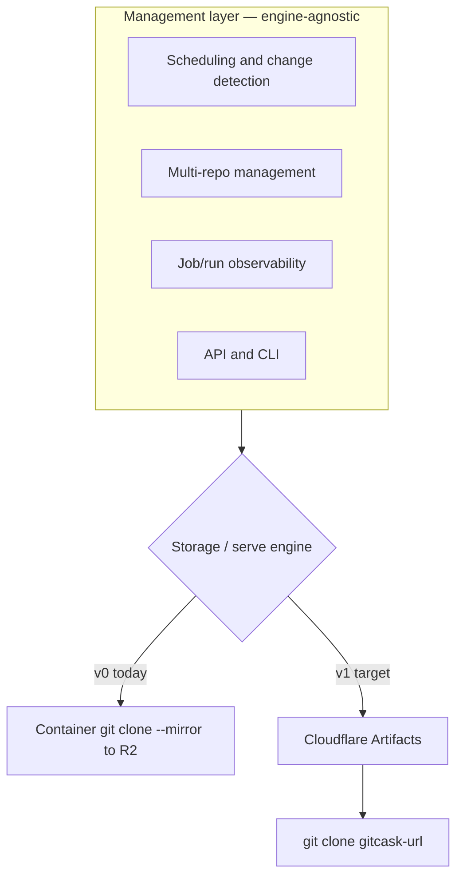

# gitcask — Positioning & Roadmap

## Summary

Reposition gitcask as an **edge-native, self-hosted git mirror**: your repositories live on Cloudflare infrastructure you control, with the North Star capability being `git clone <your-gitcask-url>`. The roadmap drives toward building gitcask's git-storage engine on **Cloudflare Artifacts**, with gitcask owning the opinionated mirror/management layer on top. The June sprint stays deliberately lean — lock this positioning, ship an honest landing page live, and clear the repo's red baseline — with the real end-to-end work sequenced immediately after.

## Problem Frame

gitcask has been carrying three identities at once, and the confusion is now the main thing blocking progress. The shipped code is an automated GitHub→R2 *mirror backup* service (container runs `git clone --mirror`, tarballs it, uploads to R2). The branding claims things the code doesn't do — encryption, a filesystem interface, restore. And the original brief frames it as a resume/portfolio piece, which undersells what it actually is to its owner: a tool to keep long-term, a portfolio centerpiece, *and* a way to prove a thing can get finished.

The "backup for safety" pitch was reactive — it took shape during the March 2026 GitHub uptime scare — and it's the weakest of the available framings. It sits in a crowded category, defends against a low-salience threat, and barely exercises the Cloudflare edge skills the project is meant to demonstrate. The honest driver is simpler: a git remote/mirror running on your own edge infrastructure is *cool to build, show, and keep* — and "cool/craft" sustains a long-term personal project better than an imagined user-need the owner wouldn't act on himself.

Two facts reshaped the decision mid-brainstorm. First, **Cloudflare Artifacts** turned out to be git-repo storage in gitcask's exact domain — versioned git storage on Cloudflare's edge, importable from GitHub, with scoped auth tokens. That makes hand-rolling a native git server both harder to justify and unnecessary: the platform now ships the hardest part as a primitive. Second, **beta access was secured directly** (flagged in), and Artifacts is built explicitly for OpenAI's Sites product — so it's a well-resourced bet, not a side experiment, and the "wait for access" risk is gone.

## Key Decisions

- **Identity: edge-native self-hosted git mirror.** The defining capability is pulling your code back out of *your own* mirror (`git clone <gitcask-url>`). Everything else serves that.
- **Backup is a property, not the pitch.** Continuous mirroring gives you a backup as a consequence of being a real mirror. It stops being the headline, which also forces honest landing copy.
- **Build on Cloudflare Artifacts, don't hand-roll the git engine.** Artifacts becomes gitcask's storage/serve engine. This removes the riskiest, hardest part of the road and makes clone-back nearly free. The dependency is acceptable: access is secured and Artifacts has a flagship first-party customer (OpenAI Sites).
- **Swappable storage/serve engine; engine-agnostic management layer.** gitcask's value — scheduling, change detection, multi-repo management, job/run observability, API/CLI — is kept separable from the git engine underneath. v0 engine is the existing container→R2 path; v1 engine is Artifacts. This is a separability principle, not a heavyweight plugin system to build now.
- **Reject the "artifact registry" pivot.** Re-pointing gitcask's *identity* at a generic artifact/registry product was considered and rejected — it dissolves the git-mirror identity instead of sharpening it. Artifacts is substrate, never the headline.
- **June stays lean.** Early beta access does not pull the integration into the sprint. The brief's central discipline is anti-scope-creep, and that holds even when the shiny new thing is available now.

## Requirements

**Positioning & identity**

- R1. gitcask is positioned as an edge-native, self-hosted git mirror — repos live on user-controlled Cloudflare infrastructure, and the North Star capability is `git clone <gitcask-url>`.
- R2. Continuous backup is framed as a property of being a mirror, not the headline pitch.
- R3. Public-facing copy must not claim encryption, a filesystem interface, or restore until those are actually implemented; the honest positioning is automated GitHub mirroring to infrastructure you control.

**June 30 deliverable (lean sprint)**

- R4. This positioning + roadmap doc exists and is the source of truth for gitcask's identity, v1 definition, and scope.
- R5. An honest landing page is deployed live on Cloudflare, with copy aligned to the mirror positioning. The filesystem/restore/queryable overclaims and the fake `install.gitcask.dev` installer have already been stripped from the inline copy in `src/index.ts`; the remaining work is deploying it live and a final copy pass.
- R6. The repo baseline is green: the current `bun run check` failure (`test/env.d.ts` `noNamespace`) is fixed, and a CI gate runs typecheck/lint/test on push.
- R7. Beta access to Cloudflare Artifacts is confirmed working (the application step is moot — already flagged in).

**Architecture**

- R8. The management layer (scheduling, change detection, multi-repo, job/run observability, API/CLI) is kept separable from the git-storage engine so the engine can be swapped without a rewrite.
- R9. The storage/serve engine is treated as swappable: v0 is the existing container `git clone --mirror` → R2 path (kept as fallback and beta-credibility artifact); v1 is Cloudflare Artifacts.

**Path to v1**

- R10. v1 is defined as the capability `git clone <gitcask-url>` working against a gitcask-managed mirror, served via Cloudflare Artifacts.
- R11. The native Worker smart-HTTP git engine is explicitly out of the v1 path, parked as an optional later craft track (see `docs/stranded-artifacts/native-git-client.md`).

## Architecture Shape

The same management layer sits above whichever engine is active. v0 ships today; v1 swaps the engine to Artifacts without disturbing the layer above.

## Roadmap

The critical path is no longer gated on external access. The management-layer work is engine-agnostic and pays off regardless of which engine wins, so it proceeds independent of Artifacts timing.

- **Phase 0 — June sprint (lean).** Lock this positioning; deploy the honest landing live (R5); clear the red baseline and add CI (R6); confirm Artifacts beta access works (R7). Outcome: a credible, honest, deployed project plus this roadmap — the shipped landing and green repo satisfy the "prove I can finish" goal without taking on build risk.
- **Phase 1 — Make the v0 engine honest and visible.** Verify one real backup end-to-end (the implemented-but-unverified clone/upload/callback loop). Expose backups *through gitcask* via the read surface in `plans/009-restore-read-api-spike.md` (latest/artifacts endpoints, CLI display). Add the durable job-event observability model from `docs/stranded-artifacts/backup-observability.md`. All engine-agnostic; none wasted if the engine later changes.
- **Phase 2 — Artifacts integration.** Spike the Artifacts API: confirm clone serving, import-from-GitHub semantics, and scoped token auth. Introduce Artifacts as the storage/serve engine behind the management layer, reaching `git clone <gitcask-url>` — the v1 capability (R10).
- **Phase 3 — v1 product polish.** Multi-repo management UX, retention/versioning policy, and the full "your repos on your infra" experience. Decide whether the container path retires or stays as a fallback engine.

## Scope Boundaries

**Deferred for later (not June)**

- Verifying the real end-to-end backup — Phase 1, immediately after the sprint.
- Any Artifacts integration work — Phase 2; early beta access does not pull it into June.
- Pulling the Artifacts API spike into the sprint — explicitly declined to hold the lean line.

**Outside this product's identity**

- Hand-rolling a native Worker smart-HTTP git engine as the v1 path — parked as a someday craft track, not the road to v1.
- Repositioning gitcask as a generic artifact/package/registry product — rejected; it dissolves the git-mirror identity.
- Application-level encryption, a filesystem interface, and any restore claim the code doesn't back — dropped from positioning until real.
- Multi-tenant SaaS, billing, and dashboard polish — per the original brief, still "not now."

## Dependencies / Assumptions

- **Artifacts beta access is secured** (flagged in directly); open beta is targeted for ~early/mid July 2026.
- **Artifacts is a durable bet**, not a side experiment — built explicitly for OpenAI's Sites product and ramping toward ~1k repos/second, which materially lowers the dependency risk of building gitcask's engine on it.
- **Assumed, to confirm in the Phase 2 spike:** that Artifacts serves `git clone` the way gitcask needs, supports import-from-GitHub at the cadence gitcask schedules, and exposes scoped tokens that fit gitcask's multi-repo model.
- **Capacity:** ~4 hrs/day through June 30; the lean June scope is sized to that, not to into-md's hardening velocity.

## Success Criteria

- **June 30:** positioning is locked in this doc; the honest landing page is live on a real gitcask URL; `bun run check` is green and CI runs on push; Artifacts access is confirmed. A stranger can read the landing and the README and understand what gitcask is without encountering a claim the code doesn't back.
- **v1:** `git clone <gitcask-url>` returns a working repo from a gitcask-managed mirror served by Artifacts, with the management layer scheduling and tracking the mirrors behind it.

## Outstanding Questions

**Deferred to planning / the Phase 2 spike**

- Does Artifacts' clone-serving, import-from-GitHub, and scoped-token model map cleanly onto gitcask's scheduled multi-repo mirroring, or does the management layer need to adapt?
- What is gitcask's retention/versioning model on top of Artifacts (how many snapshots, how addressed)?
- Once Artifacts is the engine, does the container→R2 path retire, or stay as a fallback engine worth maintaining?
