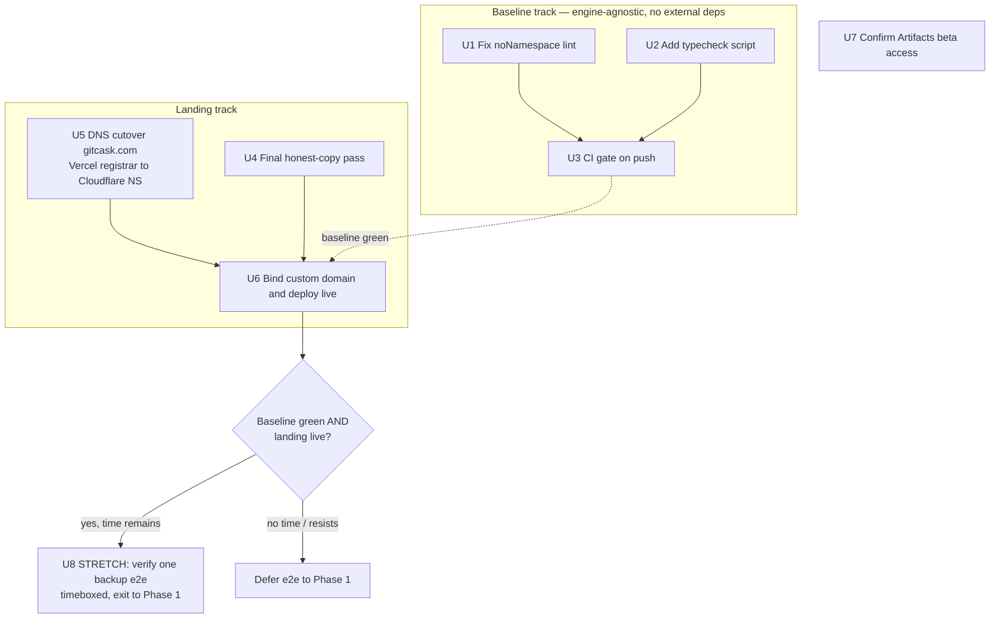

## Problem Frame

The **gitcask** project has been carrying three identities and the confusion is the main thing blocking progress (see origin: `docs/brainstorms/2026-06-22-gitcask-positioning-roadmap-requirements.md`).

The brainstorm resolved that: **gitcask** is an edge-native, self-hosted git mirror, backup is a property rather than the pitch, and the engine is built on Cloudflare Artifacts later rather than hand-rolled. June stays deliberately lean — the sprint's job is to lock that positioning into a shipped, honest, green artifact, not to take on build risk.

Two facts on the ground shape this plan.

1. The landing-copy overclaim cleanup (filesystem / restore / queryable claims and the fake `install.gitcask.dev` installer) has already landed in `src/index.ts`, so deliverable 1 narrows to a final copy pass plus the live deploy.
2. The repo baseline is red on a single lint error (`test/env.d.ts` `noNamespace`) and has no CI gate on push, while the broader deployment state is unverified across every Cloudflare resource (`docs/gitcask-state-review.md`). This plan consolidates and supersedes the unexecuted `plans/001-verification-baseline.md`.

---

## Requirements

Traced from the origin brainstorm. R8–R11 are architectural principles already honored by the current shape and the deferral boundaries; they constrain scope rather than driving a unit here.

**Positioning & honest copy**

- R1. **gitcask** is positioned as an edge-native, self-hosted git mirror; the North Star capability is `git clone <gitcask-url>` (positioning, realized in copy — see origin R1).
- R2. Continuous backup is framed as a property of being a mirror, not the headline (see origin R2).
- R3. Public-facing copy claims nothing the code doesn't do — no encryption, filesystem interface, restore, or queryable claims (see origin R3).

**June 30 deliverables**

- R4. The positioning + roadmap source-of-truth doc exists — satisfied by the origin brainstorm; no unit this sprint (see origin R4).
- R5. The honest landing page is deployed live on Cloudflare at `gitcask.com`, copy aligned to the mirror positioning.
- R6. The repo baseline is green (`bun run check` passes) and a CI gate runs lint/typecheck/test on push.
- R7. Cloudflare Artifacts beta access is confirmed working.

**Carried as constraints (not units this sprint)**

- R8/R9. The management layer stays separable from a swappable storage/serve engine; v0 is the container `git clone --mirror` → R2 path (see origin R8, R9).
- R10/R11. v1 (`git clone <gitcask-url>` via Artifacts) and the native Worker git engine are out of the June path (see origin R10, R11; Scope Boundaries below).

---

## Key Technical Decisions

- KTD1 — Suppress `noNamespace` in `test/env.d.ts`, do not rewrite it. The `declare namespace Cloudflare { interface Env }` block is the framework-sanctioned augmentation that types `import { env } from "cloudflare:test"`; removing it breaks test typing. Add a `// biome-ignore lint/style/noNamespace: …` line. The repo already uses `biome-ignore` (e.g. `src/index.ts:512`, suppressing a different rule, `noBarrelFile`) so the comment syntax is established; place the ignore on the line immediately above `declare namespace`. Use the exact rule string from live `bun run check` output, not a doc-quoted guess.
- KTD2 — Add a dedicated `typecheck` script (`tsc --noEmit`). None exists today; `ultracite check` is lint/format only and does not run `tsc`. R6's "typecheck" gate needs a real type pass to invoke in CI.
- KTD3 — CI is verification-only. The workflow runs `check` / `typecheck` / `test` on push and PR; it adds **no** deploy job. Deploy stays a manual, human-run `bun run deploy`. Do not modify `pullfrog.yml`.
- KTD4 — Ship on `gitcask.com` via Cloudflare-managed DNS. Workers custom domains require the zone's DNS to be on Cloudflare, so the path is: add `gitcask.com` as a Cloudflare zone, change nameservers at the Vercel registrar to Cloudflare's (registration stays at Vercel), then bind the custom domain in `wrangler.jsonc`. The bare `workers.dev` URL keeps serving in the interim.
- KTD5 — The landing is served inline from the Worker (`src/index.ts`), not a separate Pages project. "Deploy the landing" means deploy the Worker; no Pages config is introduced.
- KTD6 — E2E backup verification is a timeboxed stretch with a hard defer-to-Phase-1 exit, protecting the lean line if the beta-container deploy resists.

---

## High-Level Technical Design

The sprint is two independent tracks (baseline-green, landing-live) that converge on the live deploy, with the e2e backup gated as a stretch after everything else is green. The DNS cutover is the long-pole external dependency and runs in parallel from day one.

The architecture this preserves is the brainstorm's: one engine-agnostic management layer over a swappable engine (v0 container→R2 today). Nothing in this sprint touches that seam.

---

## Implementation Units

### U1. Fix the `noNamespace` lint failure in `test/env.d.ts`

- **Goal:** `bun run check` passes. The single blocking error is `test/env.d.ts:3:9 lint/style/noNamespace` on the `declare namespace Cloudflare` block.
- **Requirements:** R6
- **Dependencies:** none
- **Files:** `test/env.d.ts`
- **Approach:** Add a `// biome-ignore lint/style/noNamespace: ambient augmentation required by @cloudflare/vitest-pool-workers (types env from cloudflare:test)` line directly above the `declare namespace Cloudflare` line. Keep the interface body intact — it mirrors the exported `Env` in `src/types.ts` and supplies the typed shape tests rely on. Confirm the exact rule slug from live `bun run check` before writing the comment (`noNamespace`, distinct from the `noNamespaceImport` suppressions already in `src/`). `noNamespace` is not auto-fixable, so this is a manual edit, not `bun run fix`.
- **Patterns to follow:** existing `// biome-ignore` precedent at `src/index.ts:512`.
- **Test scenarios:** Test expectation: none — lint-config fix with no behavioral change.
- **Verification:** `bun run check` exits clean in CI. Note a local-vs-CI divergence: a developer's working tree may show a second formatter error on `.claude/settings.local.json`, which is globally gitignored (untracked) and absent from a CI checkout — so `noNamespace` is the only error CI sees, but local `check` may still report that one extra file. Don't chase it as a regression.

### U2. Add a `typecheck` script

- **Goal:** A standalone type-check command exists so CI can gate on types (R6 calls for typecheck, which `ultracite check` does not perform).
- **Requirements:** R6
- **Dependencies:** none
- **Files:** `package.json` (add script), `tsconfig.json` (only if the no-emit pass surfaces config gaps)
- **Approach:** Add `"typecheck": "tsc --noEmit"`. TypeScript is already a peer dependency (`^6.0.2`); run via `bunx tsc` if no local binary resolves. A pre-check confirmed `bunx tsc --noEmit` exits 0 against the current tree (the existing `tsconfig` `include` already covers `test/`\*\*), so no `wrangler types` generation step is needed — this is expected to be a one-line `package.json` add. If a future change introduces ambient-type gaps, prefer `wrangler types` over loosening `tsconfig` strictness.
- **Patterns to follow:** existing script style in `package.json`; Bun-first invocation per `AGENTS.md`.
- **Test scenarios:** Test expectation: none — tooling script, no runtime behavior.
- **Verification:** `bun run typecheck` runs and exits 0 against the current tree (or surfaces a genuine, recorded type gap to fix before CI turns red).

### U3. Add a verification-only CI workflow

- **Goal:** Every push and PR runs lint, typecheck, and tests; a red baseline can no longer merge silently.
- **Requirements:** R6
- **Dependencies:** U1, U2 (the gate must be green to add it without immediately failing)
- **Files:** `.github/workflows/ci.yml` (new)
- **Approach:** Trigger on `push` and `pull_request`. Steps: checkout → `oven-sh/setup-bun@v2` → `bun install --frozen-lockfile` → `bun run check` → `bun run typecheck` → `bun run test`. No deploy job (KTD3). Do not touch `pullfrog.yml`. A pre-check confirmed `bun run test` passes (24/24) with no real Cloudflare credentials — `vitest.config.ts` injects mocked bindings (`ADMIN_TOKEN`, `GITHUB_PAT`) and resolves the rest from `wrangler.jsonc` via miniflare. Keep the workflow secret-free so `pull_request` runs from forks carry no credential exposure; if a deploy/wrangler step is ever added later it must move behind an environment gate, not this workflow.
- **Patterns to follow:** Bun CI convention (`bun install --frozen-lockfile`) per `AGENTS.md`; the unexecuted `plans/001-verification-baseline.md` describes the same shape (this unit supersedes it).
- **Test scenarios:** Test expectation: none — CI config, validated by the workflow run itself.
- **Verification:** Pushing the branch triggers the workflow; all three steps pass green. Optionally dry-run locally with the `agent-ci` skill before pushing.

### U4. Final honest-copy pass on the landing page

- **Goal:** The landing copy is honest and internally consistent — no claim the code doesn't back, and no anchor/heading mismatches.
- **Requirements:** R1, R2, R3, R5
- **Dependencies:** none
- **Files:** `src/index.ts`, `test/landing.test.ts` (new)
- **Approach:** Audit the inline landing template against R3. The overclaim removal already landed; this is a final sweep. Resolve the two flagged items: the `#install` hero anchor targets a card headed "Quick setup" (align anchor or heading), and the aspirational line "Built for people who think in trees, not tickets." (≈`src/index.ts:447`) — keep, cut, or sharpen against the lean/honest tone. Confirm the install block stays the real self-host command (`bun install && bunx wrangler deploy`), not a fabricated installer. Keep `rel="noopener"` on any `target="_blank"` links per repo standards.
- **Patterns to follow:** existing inline-template structure in `src/index.ts`; route-test style in `test/api.test.ts`.
- **Test scenarios:**
   - Covers R3. `GET /` returns 200 and the body excludes the forbidden-claim substrings (`restore`, `encryption`, `encrypted`, `filesystem`, `queryable`, `install.gitcask.dev`) — a regression guard so a future copy edit can't silently re-introduce an overclaim.
   - `GET /` body contains the mirror-positioning anchor copy (e.g. "Mirror your GitHub repos") so the honest framing is asserted, not just the absence of bad words.
   - The `#install` anchor resolves to an element actually present in the rendered body (no dangling in-page link).
- **Verification:** `bun run test` passes including the new landing test; a manual read of the rendered page surfaces no claim the code doesn't back.

### U5. DNS cutover for `gitcask.com` to Cloudflare

- **Goal:** `gitcask.com` is a live, active Cloudflare-managed zone, so a Worker custom domain can be bound to it.
- **Requirements:** R5
- **Dependencies:** none (external; start early — propagation is the long pole)
- **Files:** none (infrastructure/registrar operation)
- **Approach:** Add `gitcask.com` as a zone in the Cloudflare dashboard; Cloudflare issues nameservers. At the Vercel registrar, change the domain's nameservers to Cloudflare's (registration stays at Vercel; only DNS authority moves). Wait for Cloudflare to mark the zone Active. Recreate any existing DNS records that must keep resolving during the move before flipping nameservers, to avoid an outage on other `gitcask.com` services.
- **Patterns to follow:** standard Cloudflare zone onboarding (the `cloudflare` / `wrangler` skills cover custom-domain prerequisites).
- **Test scenarios:** Test expectation: none — infrastructure change, validated by DNS state.
- **Verification:** `dig NS gitcask.com` returns Cloudflare nameservers; the Cloudflare dashboard shows the zone Active.

### U6. Bind the custom domain and deploy live

- **Goal:** The honest landing serves at `https://gitcask.com`.
- **Requirements:** R5
- **Dependencies:** U4 (honest copy ready), U5 (zone active); baseline green (U1–U3) confirmed before promoting — run `bun run check` as an explicit pre-deploy gate since deploy is manual (KTD3) and CI does not block it.
- **Files:** `wrangler.jsonc`
- **Approach:**
   - **Production env couples the landing to the container stack — resolve this first.** The existing `production` env in `wrangler.jsonc` carries the `BackupContainer` container (`./container/Dockerfile`, Cloudflare Containers beta), its Durable Object + migration, D1, R2, and queues. `wrangler deploy --env=production` builds and binds all of them, so a beta-container build failure can block the landing — the exact risk U8 was meant to quarantine. Before deploying: either confirm `wrangler deploy` brings the Worker live when the container can't build, or carve a **landing-only production target** (a deploy env stripped of the container/DO/D1/R2 bindings) so U6 cannot be derailed by container beta state. This decision gates U6.
   - Add the custom-domain binding for the chosen production target in `wrangler.jsonc` (a `routes` entry with `custom_domain: true` for `gitcask.com`, alongside the existing `gitcask-production.nico-baier.workers.dev`), then deploy with `bun run deploy`.
   - **Cap remediation.** Limit fixes here to Worker secrets and `wrangler.jsonc` config gaps that block the landing from serving. Any D1 / R2 / Container / backup-path gap is deferred to U8 or Phase 1, not resolved in U6.
   - Update `WORKER_URL` (production var) to `https://gitcask.com` so self-referential callback URLs match the live host.
   - **Set secrets via** `wrangler secret put` (`ADMIN_TOKEN`, `GITHUB_PAT`, and for U8 the R2 S3 credentials) — never commit them to `wrangler.jsonc` or echo them into shell history/logs.
   - **Gate the public debug endpoints.** `/health/debug/connectivity` and `/health/debug/container-jobs` are unauthenticated and leak infrastructure state once `gitcask.com` is public (`docs/gitcask-state-review.md` lists this as a pre-public-exposure blocker; `plans/003-auth-gate-debug-endpoints.md` has the fix). Decide before going live: auth-gate them as a U6 prerequisite, or accept the exposure for a low-traffic launch — see Open Questions.
- **Patterns to follow:** existing `production` env block and `deploy` script in `package.json`/`wrangler.jsonc`; the `wrangler` skill for custom-domain and `secret put` syntax.
- **Test scenarios:** Test expectation: none — deploy/config step, validated live.
- **Verification:** `https://gitcask.com` returns the honest landing (200, mirror copy); the `workers.dev` URL still serves; `WORKER_URL` reflects the live host; no secret values appear in deploy output; the debug-endpoint decision above is resolved (gated or explicitly accepted).

### U7. Confirm Cloudflare Artifacts beta access

- **Goal:** Artifacts beta access is confirmed working, closing R7.
- **Requirements:** R7
- **Dependencies:** none
- **Files:** none (verification; optionally a one-line note in `docs/gitcask-state-review.md`)
- **Approach:** Verify the flagged-in beta access is live via the Cloudflare dashboard or API — confirm the account can see/operate Artifacts. No integration code (that is Phase 2). If access is somehow not live, that is a finding to record, not a build task.
- **Patterns to follow:** none — account/dashboard check.
- **Test scenarios:** Test expectation: none — access verification, no code.
- **Verification:** Artifacts surface is reachable for the account; the result (confirmed / not-yet) is recorded.

### U8. STRETCH — verify one backup end-to-end (timeboxed)

- **Goal:** Prove the implemented v0 engine actually runs on live infra: one real repo backed up clone → tar → R2, with `runs`/`jobs` rows and the callback firing.
- **Requirements:** advances origin Phase 1; not a committed June requirement
- **Dependencies:** U6 (worker live) and baseline green; attempted only after all committed deliverables are done
- **Files:** none expected (deploy/secrets/ops); only touch code if a genuine blocking defect is found, in which case scope it as a follow-up
- **Approach:** Stand up the live v0 path — remote D1 created and migrations applied, remote R2 bucket present, the container image (`container/Dockerfile`) built and deployed (Cloudflare Containers, beta), and all secrets set including the **R2 S3 credentials** the container uploads through (`R2_ACCESS_KEY_ID` / `R2_SECRET_ACCESS_KEY` / `R2_ENDPOINT`) plus `GITHUB_PAT`, `ADMIN_TOKEN`, `WORKER_URL`. Trigger one backup of a single repo and confirm the artifact lands in R2 with matching `runs`/`jobs` state and a successful callback. Never surface PATs, R2/S3 credentials, callback tokens, or credentialed clone URLs in logs or persisted event details.
- **Execution note:** Hard timebox — **attempt only if all committed deliverables (U1–U7) are done and verified, and only on or before June 29; cap the attempt at one working session (~4 hrs).** If the beta-container deploy, secrets, or the AWS-SDK-to-R2 path resist within that box, stop and roll this to Phase 1 — do not let it consume committed-deliverable capacity. The exit is a pre-committed number, not a judgment call made mid-troubleshoot.
- **Patterns to follow:** the existing scheduled→queue→container→callback flow in `src/index.ts` and `container/server.ts`; the `wrangler` skill for container/secrets commands.
- **Test scenarios:** Test expectation: none — live end-to-end verification, not an automated test (the loop already has unit coverage; this proves it on real infra).
- **Verification:** A backup artifact for the test repo exists in R2; the corresponding `runs` row reads success and the callback updated `jobs`; no secret values appear in any log or event detail.

---

## Timeline & Sequencing

Target: **U1–U7 done and verified by June 30** (a 7-day runway from June 23). The work is agent-assisted, so the coding units (U1–U4) are small and parallelizable — the schedule's wall-clock is set by the DNS long pole (U5) and the two human-in-the-loop U6 decisions, not by implementation effort. Front-load U5 on day one and let agents run the baseline track and copy pass concurrently while DNS propagates.

| Window | Target date | Units | Gating / notes |
|---|---|---|---|
| Day 1 | Jun 23 | U5 (kick off), U1, U2, U3, U7 | Start the DNS cutover first — it is the wall-clock long pole. Agents land the baseline track (U1 → U2 → U3) in one session; U7 is a quick dashboard check. |
| Days 2–3 | Jun 24–25 | U4; resolve U6 decisions | Honest-copy pass + landing test. Settle the two U6 gating decisions (debug-endpoint auth, container decoupling) while DNS propagates. |
| Days 4–5 | Jun 26–27 | U6 | Once the `gitcask.com` zone is Active (U5), copy is done (U4), and baseline is green (U1–U3): bind the custom domain and deploy live. Budget for first-deploy config/secret gaps. |
| Day 6 | Jun 28 | — (verify) | Buffer + confirm R5/R6/R7 are met: `gitcask.com` serving honest copy, CI green on push, Artifacts access confirmed. |
| Day 7 | Jun 29 | U8 (stretch) | Only if U1–U7 are done and verified; one ~4 hr session per the U8 timebox. Roll to Phase 1 if it resists. |
| Deadline | Jun 30 | — | All committed deliverables (U1–U7) complete. |

If DNS propagation runs long (the 24–48h case), U6 slips within the window but R5 is still met via the `workers.dev` fallback (see Risks), with the `gitcask.com` cutover finishing immediately after. Agent parallelism absorbs slippage on the coding units; it cannot compress DNS propagation or the U6 decisions, which is why both start early.

---

## Risks & Dependencies

- **DNS cutover is the long pole.** Nameserver changes at the Vercel registrar plus Cloudflare activation can take hours and occasionally 24–48h; two assumptions to verify early are that the Vercel registrar permits delegating nameservers to Cloudflare while registration stays at Vercel, and that activation lands before June 30. Mitigate by starting U5 on day one and keeping `workers.dev` live in the interim. R5 fallback: if `gitcask.com` is not Active by June 30, R5 is met by the honest landing serving on the `workers.dev` URL, with the `gitcask.com` cutover finishing on the first post-sprint day.
- **Existing** `gitcask.com` **records.** If the domain currently resolves anything (mail, other services), moving nameservers to Cloudflare without recreating those records first causes an outage. Inventory and recreate before flipping (U5).
- **Deployment state is unverified.** `docs/gitcask-state-review.md` marks every Cloudflare resource UNKNOWN — the first real production deploy (U6) may surface secret/config gaps for the worker; budget for that.
- **Beta-container reliability (U8 only).** Cloudflare Containers are beta and the AWS-SDK-to-R2 upload path is unverified end-to-end. This is concentrated in the stretch unit and fenced by the timebox/exit (KTD6).
- **Secrets discipline.** Any deploy/CI/backup step must keep GitHub PATs, R2/S3 credentials, and callback tokens out of logs, CI output, and persisted events.
- **CI test step.** vitest-pool-workers must resolve `wrangler.jsonc` in the CI checkout; bindings are mocked in `vitest.config.ts`, so no real credentials are needed — confirm during U3.

---

## Scope Boundaries

**Deferred to follow-up work (plan-local sequencing)**

- Custom domain on `gitcask.dev` (the preferred name) — a later rename once `gitcask.com` is live.
- The durable job-event observability model (`docs/stranded-artifacts/backup-observability.md`) — Phase 1, beyond the e2e stretch.

**Deferred for later (from origin)**

- The rest of Phase 1 — the read surface / restore-read API (`plans/009-restore-read-api-spike.md`) and the job-event observability model — which are peers of e2e verification in the origin roadmap, not sequenced after it. Only the one-backup e2e check is pulled forward as the U8 stretch; the read surface and observability stay in Phase 1.
- All Cloudflare Artifacts integration work — Phase 2; early beta access does not pull it into June (see origin Scope Boundaries).
- The Artifacts API spike — explicitly declined for June.

**Outside this product's identity (from origin)**

- Hand-rolling a native Worker smart-HTTP git engine as the v1 path (parked craft track; see origin R11).
- Repositioning gitcask as a generic artifact/package/registry product (rejected).
- Application-level encryption, a filesystem interface, and any restore claim the code doesn't back.
- Multi-tenant SaaS, billing, and dashboard polish.

---

## Open Questions

- **Public debug endpoints (U6, decision needed before going live):** auth-gate `/health/debug/`\* (`plans/003-auth-gate-debug-endpoints.md`) as a U6 prerequisite, or accept the unauthenticated infra-state exposure for a low-traffic launch? Going live on `gitcask.com` without a decision is the unsafe default.
- **Production deploy shape (U6):** does `wrangler deploy --env=production` bring the Worker live when the beta container can't build, or is a landing-only production target needed to decouple the committed deploy from container beta state?
- `gitcask.com` **existing records (U5):** does the domain currently resolve any production services that must survive the nameserver move? Inventory before cutover. Also confirm the Vercel registrar allows the nameserver delegation.
- **Secret scoping (U8):** what is the minimum `GITHUB_PAT` scope (read-only contents on the mirrored repos) and is the R2 S3 credential scoped to the `gitcask-backups` bucket only? Decide before setting them in production.

---

## Sources & Research

- Origin brainstorm: `docs/brainstorms/2026-06-22-gitcask-positioning-roadmap-requirements.md` (positioning, requirements, roadmap, scope boundaries).
- Superseded baseline plan: `plans/001-verification-baseline.md` (same lint+CI shape, unexecuted — consolidated here).
- State review: `docs/gitcask-state-review.md` (deployment status UNKNOWN across resources; container uploads to R2 via S3 credentials, not the R2 binding).
- Lint failure: `test/env.d.ts:3` `lint/style/noNamespace`; suppression precedent at `src/index.ts:512`.
- Engine/backup architecture: `src/index.ts`, `container/server.ts`, `wrangler.jsonc`; salvage notes in `docs/stranded-artifacts/`.
- Tooling: `package.json` (`check`/`test`/`deploy` scripts, no `typecheck`), `vitest.config.ts` (mocked bindings), `.github/workflows/pullfrog.yml` (manual-only, do not edit).
